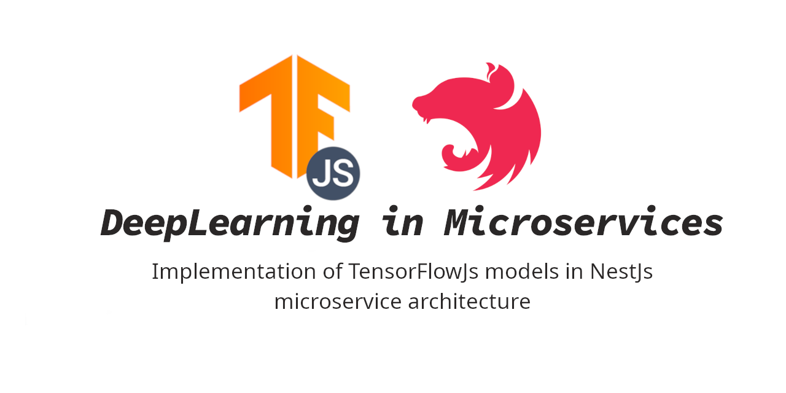

<p align="center">
  
</p>

# DeepLearning in Microservices

Implementation of TensorFlowJs models in NestJs microservice architecture

## Description

This project consists of two microservices. The first microservice is called **_App_** and acts as a gateway. App receives user _Text_ and send it to another microservice called **_Ai_** through a _gRPC_ connection. Ai analyzes the text and return _toxicity_ as a boolean. Also, the type of toxicity is returned in six different categories : `identity_attack`, `insult`, `obscene`, `severe_toxicity`, `sexual_explicit`, and `threat`. The results produces from a pre-trained network in [_Pre-trained TensorFlow.js models_](https://github.com/tensorflow/tfjs-models/tree/master), specifically the [_Toxicity classifier_](https://github.com/tensorflow/tfjs-models/tree/master/toxicity). It needless to say, that you can substitute toxicity model with your models and use this API for any custom application.

A straightforward illustration of the project presented below:

## Installation

Clone the project

```bash
git clone https://github.com/armin3731/nestjs-tensorflowjs-microservice
```

Go to the project directory

```bash
cd nestjs-tensorflowjs-microservice
```

Install dependencies

```bash
npm ci
```

It is recommended to use `ci` or _clean-install_ instead of normal package installation because toxicity model is very sensitive to TensorflowJs version.

## Environment Variables

To run this project, you will need to add the following environment variables to your .env file (or just rename **.env.example**)

`AI_HOST`

`AI_RPC_PORT`

`APP_HOST`

`APP_HTTP_PORT`

`APP_RPC_PORT`

## Running the app

First you need to run the App microservice:

```bash
# runs App microservice as default
$ npm run start

# or
$ npm run start app
```

Then open another terminal and run Ai microservice:

```bash
# Ai microservice
$ npm run start ai
```

**Note!** Starting Ai microservice will take some seconds, because it loads the model at start.

**Note!** To my dear friends from Iran. Use a tunneling system while running Ai microservice, because google cloud won't let you download the model.

If you use **.env.example** as your ENV variables, you will see a swagger api documentation on `http://localhost:3000/api`

## API Reference

#### Analyzing Toxicity

```http
  Post /analysis
```

| Parameter | Type     | Description                                                      |
| :-------- | :------- | :--------------------------------------------------------------- |
| `text`    | `string` | **Required**. The Text you want to find out if it's Toxic or Not |

## Screenshots


## Tech Stack

**ML:** TensorflowJs

**Server:** Node, NestJs

## Test

```bash
# unit tests
$ npm run test

# e2e tests
$ npm run test:e2e

# test coverage
$ npm run test:cov
```

## Support

Nest is an MIT-licensed open source project. It can grow thanks to the sponsors and support by the amazing backers. If you'd like to join them, please [read more here](https://docs.nestjs.com/support).

## Stay in touch

- Author - [Kamil Myśliwiec](https://kamilmysliwiec.com)
- Website - [https://nestjs.com](https://nestjs.com/)
- Twitter - [@nestframework](https://twitter.com/nestframework)

## License

Nest is [MIT licensed](LICENSE).
